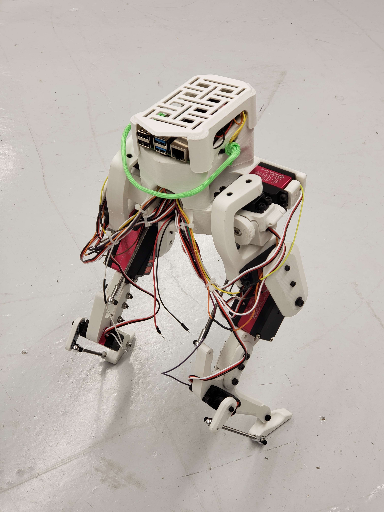

# Legolas - An Open Source Bipedal Robot

Legolas is a mini bipedal robot inspired by the Cassie by Agility Robotics. The project aims to provide an open-source platform for learning and applying reinforcement learning in robotics.

<p align="center">
  
  
</p>

<p align="center">
  <a href="assets/Walking_Test_3.mp4"></a>
</p>

## Repository Contents

This repository contains CAD files and 3D printing files for Legolas. 

The code for the robot is available at [Legolas Controller](https://github.com/daviddoo02/Legolas_Controller).

## Getting Started

1. **Clone this repository:**

    ```bash
    git clone https://github.com/daviddoo02/Legolas-an-open-source-biped/
    ```

2. **Modify the CAD files:**

    Modify the CAD files to fit your specific needs using Solidworks.

3. **3D Print your own robot:**

    Alternatively, use the provided STL files located in `CAD/Legolas/V2/STLs` to 3D print your own robot.

4. **Assemble the robot and have fun!**

## Required Materials

Materials and components used are listed and linked below.

### Main Body

| Part | Price | Purchased |
|------|-------| --------- |
| 1. [3D printing filament x 1 kg](https://www.amazon.com/dp/B089S1HB8K) | -- | :white_check_mark:
| 2. [Metric Nuts and Bolts](https://www.amazon.com/Assortment-M2-M3-M4-M5/dp/B0CBMMPPKF) | $12 | :white_check_mark: |
| 3. [Metric Locknuts](https://www.amazon.com/dp/B0CHVTYLWC) | $7 | :white_check_mark: |
| 4. [Thrust Bearings](https://www.amazon.com/gp/product/B08FHTD8VT) | $3 | :white_check_mark: |
| 5. [Ball joint rod end](https://www.amazon.com/gp/product/B0828T1NNW) | $5 | :white_check_mark: |
| 6. [M4 threaded rod](https://www.amazon.com/gp/product/B01MAYQ12S) | $3 | :white_check_mark: |
| **Total** | **$30** |

### Electronics

| Part | Price | Purchased | Delivered |
| ---- | ----- | --------- | --------- |
| 1. [PCA9685 Servo Driver Board](https://www.amazon.com/gp/product/B07BRS249H) | $14 | :white_check_mark: | :white_check_mark: |
| 2. [40 kg Hobby Servos x 8](https://www.amazon.com/Servo-Torque-Waterproof-Degree-Compatible/dp/B0C95YMMQS) | $204 | :white_check_mark: | :white_check_mark: |
| 3. [80 kg Hobby Servos x 2](https://www.amazon.com/GoolRC-Digital-Torque-Waterproof-Replacements/dp/B0B5H4MWZG/ref=sr_1_2?crid=1JM9GBMY97KTM&keywords=80%2Bkg%2Bservo&qid=1705472455&sprefix=80%2Bkg%2Bservo%2Caps%2C98&sr=8-2&th=1) | $86 | :white_check_mark: | :white_check_mark: |
| 4. [MPU9255 IMU](https://www.amazon.com/-/he/dp/B0D4VYR8KF?ref=ppx_yo2ov_dt_b_fed_asin_title) | $25 | :white_check_mark: | :white_check_mark: |
| 5. [ADS1115 ADC](https://www.amazon.com/gp/product/B07VPFLSMX) | $16 |  :white_check_mark: |
| 6. [Jumper Wires](https://www.amazon.com/Elegoo-EL-CP-004-Multicolored-Breadboard-arduino/dp/B01EV70C78) | $7 | :white_check_mark: |
| 7. [Power DIY Connector](https://www.amazon.com/dp/B09S3S6RYC) | $2 | :white_check_mark: |
| 8. [USB C Connector](https://www.amazon.com/gp/product/B0CN64BR49/ref=ox_sc_act_title_1?smid=AJAM3W8TYBUO0&psc=1) | $15 | :white_check_mark: |
| 9. [4 to 1 Wire Connector](https://www.amazon.com/dp/B0B28GNVGZ) | $2 | :white_check_mark: |
| 10. shipping | $18 | :white_check_mark: | :ballot_box_with_check: |
| **Total** | **$389** |

### Compute
| Part | Price | Purchased | Delivered |
| ---- | ----- | --------- | --------- |
| 1. [jetson orin nano super developer kit](https://crg.co.il/product/nvidia-jetson-orin-nano-8gb-development-kit/) | $269 | :white_check_mark: | :white_check_mark:
| 2. Shipping | $13 | :white_check_mark: | :ballot_box_with_check: |
| 3. VAT | $48 | :white_check_mark: | :ballot_box_with_check: |
| **Total** | **$330** |


## Sensors
| Part | Price | Purchased |
| ---- | ----- | --------- |
| 1. [Oak-D Light Depth Camera](https://shop.luxonis.com/products/oak-d-lite-1) | $149 |
| 2. [D435 Depth Camera](https://www.amazon.com/Intel-Depth-Camera-D435-Tracking/dp/B07B43WP7V) | $0 | :white_check_mark: |
| 3. [T-MINI-Plus Lidar TOF](https://www.amazon.com/dp/B0CCJRWKC5) | $79 |
| 4. [Logitech F710 Controller](https://www.amazon.com/Logitech-940-000117-Gamepad-F710/dp/B0041RR0TW) | $40 |


## Assembly Instruction

Instructions and examples for assembling Legolas will be added in future updates.

## License

This project is licensed under the MIT License - see the [LICENSE](LICENSE) file for details.

## Acknowledgments

- Inspired by the Cassie robot by Agility Robotics.
- Solidworks was used for the physical design of the robot.
